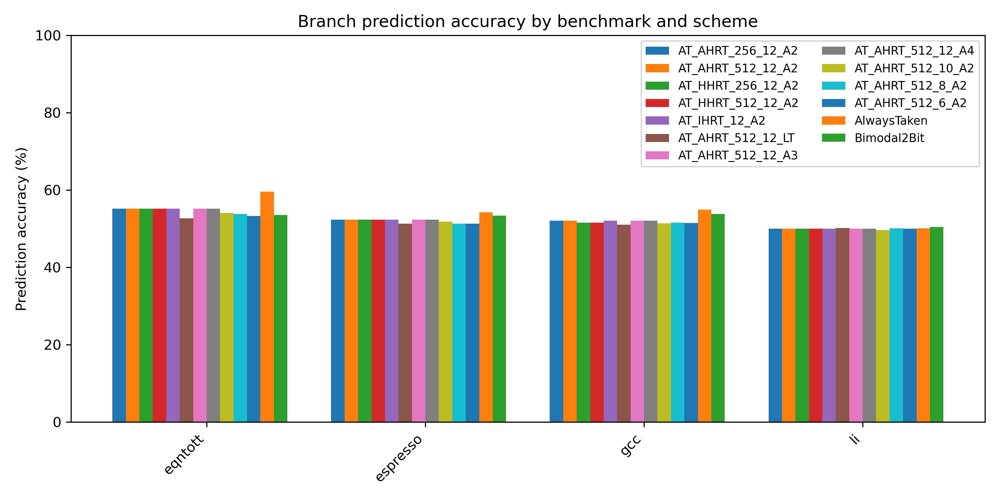
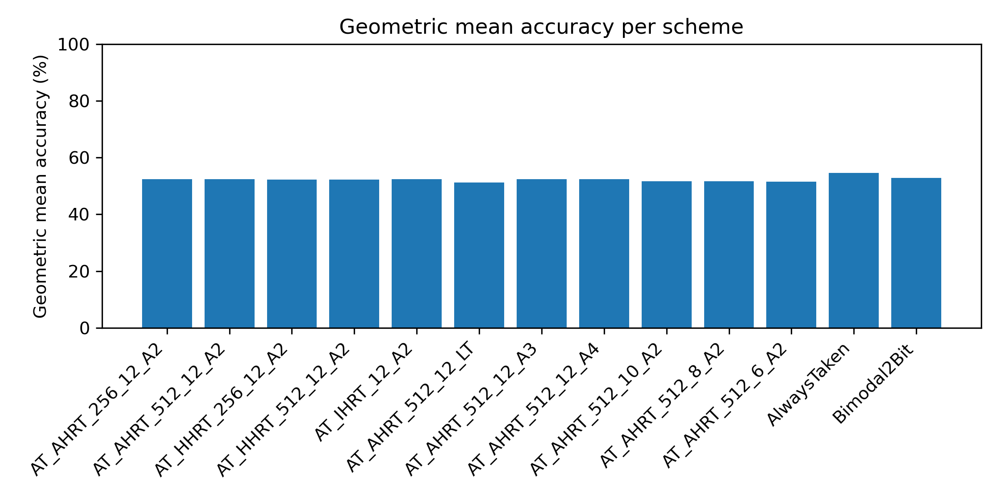

# Two-Level Adaptive Training Branch Predictor (Yeh & Patt, MICRO-24)

This repository is a course project implementation of:

> Tse-Yu Yeh and Yale N. Patt,  
> **"Two-Level Adaptive Training Branch Prediction"**, MICRO-24, 1991.

It implements the **Two-Level Adaptive Training (AT)** branch predictor, including different history-register table designs and pattern-table finite-state machines, and compares them to simple baselines. It also includes scripts to aggregate results and generate graphs similar in spirit to those in the paper.

---

## 1. Project Structure

```text
two_level_bp/
├── .gitignore               # Ignore build artifacts, editor junk, etc.
├── CMakeLists.txt           # Optional CMake build
├── README.md                # This file
├── include/                 # C++ headers (core predictor implementation)
│   ├── types.hpp
│   ├── stats.hpp
│   ├── automaton.hpp        # Last-Time, A2, A3, A4 automata (Fig. 2)
│   ├── hrt.hpp              # History Register Table (IHRT / AHRT / HHRT)
│   ├── pattern_table.hpp    # Pattern table PT(2^k, automaton)
│   ├── at_config.hpp        # Config structures (k, HRT type, etc.)
│   ├── two_level_at.hpp     # Two-level AT predictor core
│   └── predictors.hpp       # Simple baselines (AlwaysTaken, Bimodal2Bit)
├── src/
│   ├── main.cpp             # Experiment driver (loads traces, runs configs)
│   ├── hrt.cpp
│   ├── pattern_table.cpp
│   └── two_level_at.cpp
├── analysis/
│   ├── aggregate_results.py # Extract CSV rows from bp_sim logs
│   ├── plot_results.py      # Generate accuracy graphs from results.csv
│   ├── results.csv          # (Generated) Aggregated results over benchmarks
│   ├── accuracy_by_benchmark.png  # (Generated) Accuracy per benchmark+scheme
│   └── accuracy_by_scheme.png     # (Generated) Geometric mean per scheme
├── report/
│   └── report_template.md   # Skeleton for your written project report
└── traces/
    ├── eqntott_synth.txt    # Example synthetic traces (optional)
    ├── espresso_synth.txt
    ├── gcc_synth.txt
    └── li_synth.txt
````

---

## 2. Quick Start

### 2.1 Clone

```bash
git clone git@github.com:Divya2030/two_level_bp.git
cd two_level_bp
```

### 2.2 Build the simulator

#### Option A: Build with `g++` (simple and recommended)

```bash
g++ -std=c++17 -O2 \
    src/main.cpp src/hrt.cpp src/pattern_table.cpp src/two_level_at.cpp \
    -Iinclude -o bp_sim
```

With extra warnings (optional):

```bash
g++ -std=c++17 -O2 -Wall -Wextra -pedantic \
    src/main.cpp src/hrt.cpp src/pattern_table.cpp src/two_level_at.cpp \
    -Iinclude -o bp_sim
```

#### Option B: Build with CMake (optional)

Install CMake (Ubuntu):

```bash
sudo apt update
sudo apt install cmake
```

Then:

```bash
mkdir -p build
cd build
cmake ..
make

# Run from build directory:
./bp_sim ../traces/eqntott_synth.txt eqntott
```

---

## 3. Trace Format

The simulator consumes **dynamic branch traces** with **one branch per line**:

```text
<pc_hex> <taken_bit>
```

Example:

```text
0x1000 1
0x1004 0
0x1008 1
```

* `pc_hex` – Static branch PC (e.g., instruction address).
* `taken_bit` – `1` = branch taken, `0` = branch not taken.

You can use:

* Real traces (e.g., from an ISA simulator or gem5), or
* The synthetic traces in `traces/*.txt` (example generator below).

---

## 4. Running the Simulator

Basic usage:

```bash
./bp_sim <trace_file> <benchmark_name>
```

Example:

```bash
./bp_sim traces/eqntott_synth.txt eqntott
```

This prints:

* A header with the trace file and benchmark name.
* A section of **Two-Level AT schemes**:

  * Different HRT implementations (AHRT / HHRT / IHRT)
  * Different history lengths `k`
  * Different automata (A2, A3, A4, Last-Time)
* A **Baselines** section:

  * AlwaysTaken
  * Bimodal2Bit (per-branch 2-bit saturating counter)
* A final **CSV block** that looks like this:

```text
=== CSV (copy/paste into analysis/results.csv) ===
benchmark,scheme,total,correct,accuracy,hw_bits
eqntott,AT_AHRT_256_12_A2,50000,27612,55.22,11264
...
eqntott,AlwaysTaken,50000,29792,59.58,0
eqntott,Bimodal2Bit,50000,26773,53.55,0
```

The **accuracy** column is in %, and **hw_bits** is an approximate hardware cost (from the number of HRT bits + PT bits).

---

## 5. Generating Synthetic Traces (optional)

If you don’t have real traces yet, you can create some synthetic benchmarks that roughly mimic different behaviors (loop-heavy, irregular, mixed, etc.).

From repo root:

```bash
mkdir -p traces

python3 - << 'EOF'
import random

random.seed(0)

def gen_trace(path, num_branches, pcs, bias_map):
    with open(path, "w") as f:
        for _ in range(num_branches):
            pc = random.choice(pcs)
            p_taken = bias_map.get(pc, 0.5)
            taken = 1 if random.random() < p_taken else 0
            f.write(f"0x{pc:x} {taken}\n")

pcs_int = [0x1000, 0x1004, 0x1008, 0x1010, 0x1014]
pcs_fp  = [0x2000, 0x2004, 0x2008, 0x2010, 0x2014]

# eqntott-like: mostly taken
gen_trace(
    "traces/eqntott_synth.txt",
    num_branches=50000,
    pcs=pcs_int,
    bias_map={pc: 0.6 for pc in pcs_int}
)

# espresso-like: irregular mix
gen_trace(
    "traces/espresso_synth.txt",
    num_branches=50000,
    pcs=pcs_int,
    bias_map={
        0x1000: 0.5,
        0x1004: 0.7,
        0x1008: 0.4,
        0x1010: 0.6,
        0x1014: 0.5,
    }
)

# gcc-like: many branches, mixed behavior
gen_trace(
    "traces/gcc_synth.txt",
    num_branches=80000,
    pcs=pcs_int + pcs_fp,
    bias_map={
        0x1000: 0.55,
        0x1004: 0.65,
        0x1008: 0.45,
        0x1010: 0.5,
        0x1014: 0.6,
        0x2000: 0.7,
        0x2004: 0.4,
        0x2008: 0.5,
        0x2010: 0.55,
        0x2014: 0.6,
    }
)

# li-like: smaller, noisier
gen_trace(
    "traces/li_synth.txt",
    num_branches=30000,
    pcs=pcs_int,
    bias_map={
        0x1000: 0.5,
        0x1004: 0.5,
        0x1008: 0.55,
        0x1010: 0.45,
        0x1014: 0.5,
    }
)

print("Synthetic traces generated in ./traces/")
EOF
```

---

## 6. Multi-Benchmark Evaluation Pipeline

This project includes a small analysis pipeline to:

1. Run `bp_sim` on multiple benchmarks
2. Aggregate all CSV blocks
3. Generate graphs similar in spirit to the paper’s plots

### 6.1 Run all benchmarks and collect logs

From repo root:

```bash
rm -f all_logs.txt

./bp_sim traces/eqntott_synth.txt   eqntott   >> all_logs.txt
./bp_sim traces/espresso_synth.txt  espresso >> all_logs.txt
./bp_sim traces/gcc_synth.txt       gcc      >> all_logs.txt
./bp_sim traces/li_synth.txt        li       >> all_logs.txt
```

You can inspect the log:

```bash
head all_logs.txt
tail -n 40 all_logs.txt
```

### 6.2 Aggregate CSV rows into `analysis/results.csv`

```bash
cd analysis
python3 aggregate_results.py ../all_logs.txt
```

Now you should see:

```bash
ls
# aggregate_results.py  plot_results.py  results.csv  ...
head results.csv
```

`results.csv` has rows like:

```csv
benchmark,scheme,total,correct,accuracy,hw_bits
eqntott,AT_AHRT_256_12_A2,50000,27612,55.22,11264
...
li,Bimodal2Bit,30000,...,0
```

### 6.3 Install matplotlib (for plotting)

On Ubuntu:

```bash
sudo apt update
sudo apt install python3-matplotlib
```

### 6.4 Generate graphs

Still in `analysis/`:

```bash
python3 plot_results.py
```

This produces:

* `analysis/accuracy_by_benchmark.png`
* `analysis/accuracy_by_scheme.png`

---

## 7. Evaluation Graphs (example)

If generated, the graphs are:

* Accuracy per benchmark and scheme:



* Geometric mean accuracy per scheme:



These are useful to compare:

* Two-Level AT configurations (different HRTs, k, automata)
* Against simple baselines (AlwaysTaken, Bimodal2Bit)

---

## 8. Mapping Code to Yeh & Patt Paper

This project is structured to mirror the notation and components of the paper.

* **Two-Level AT structure** (Section 2 & 2.1, Fig. 1):

  * `include/two_level_at.hpp`
  * `src/two_level_at.cpp`

* **History Register Table (HRT)** (Section 3.1):

  * Ideal HRT (IHRT) – per-static-branch
  * Associative HRT (AHRT) – 4-way set-associative
  * Hash HRT (HHRT) – hashed table
  * Implemented in:

    * `include/hrt.hpp`
    * `src/hrt.cpp`

* **Pattern Table PT(2^k, automaton)**:

  * `include/pattern_table.hpp`
  * `src/pattern_table.cpp`

* **Finite-State Automata for pattern history** (Fig. 2):

  * Last-Time
  * A2, A3, A4 style 2-bit/4-state counters
  * Implemented in:

    * `include/automaton.hpp`

* **Baselines**:

  * AlwaysTaken
  * Bimodal2Bit (2-bit saturating per-branch)
  * Implemented in:

    * `include/predictors.hpp`

* **Experiment driver** (Section 4 & 5 evaluation):

  * Handles:

    * Loading trace files
    * Running all predictor configs
    * Printing stats
    * Emitting CSV blocks for post-processing
  * Implemented in:

    * `src/main.cpp`

---

